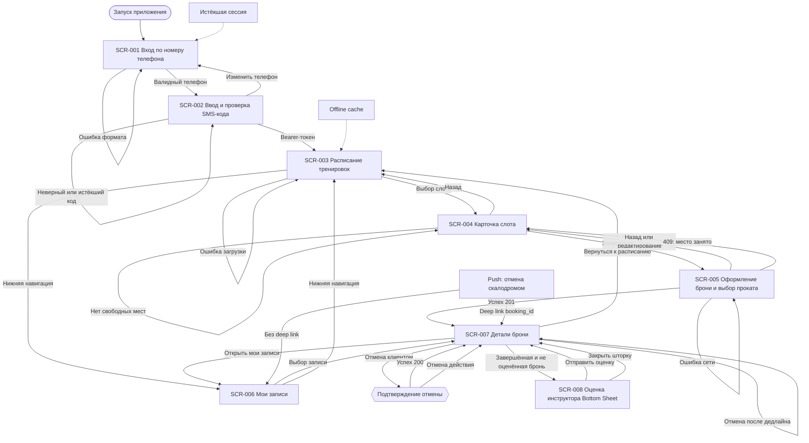

# Навигация мобильного приложения Surf

## 1. Назначение

Граф описывает переходы между `SCR-001…SCR-008`, включая deep link из push-уведомления об отмене скалодромом. Авторизация является единственным входом в клиентскую зону приложения.

## 2. Граф переходов

## 3. Правила переходов

| Переход | Условие | Результат |
|---|---|---|
| `SCR-001 → SCR-002` | Телефон проходит формат E.164 | Запрашивается SMS-код |
| `SCR-002 → SCR-003` | Код проверен, получен Bearer-токен | Открывается расписание |
| `SCR-003 → SCR-004` | Выбран доступный слот | Открывается карточка |
| `SCR-004 → SCR-005` | Клиент нажал «Записаться» | Открывается форма одной брони |
| `SCR-005 → SCR-007` | API вернул HTTP 201 | Показывается подтверждённая бронь |
| `SCR-005 → SCR-004` | API вернул HTTP 409 | Локальная бронь не создаётся, пользователь выбирает обновлённый слот |
| `SCR-006 → SCR-007` | Выбрана запись текущего клиента | Открываются статус и разрешённые действия |
| Push → `SCR-007` | В push есть `booking_id` | Открывается деталь затронутой брони |
| Push → `SCR-006` | В push нет корректного `booking_id` | Открывается список для ручного поиска |
| `SCR-007 → SCR-008` | Бронь завершена и не оценена | Открывается Bottom Sheet |
| `SCR-007 → SCR-001` | Сессия истекла | Требуется повторная авторизация |

## 4. Глобальные состояния навигации

- `Loading` не блокирует системный Back, но блокирует повторное отправяющее действие.
- `Offline` разрешает переход в `SCR-003` из кэша и блокирует `SCR-005` до восстановления сети.
- `Error` сохраняет текущий экран и предлагает безопасный Retry; он не подменяется пустым расписанием.
- `Empty State` в `SCR-003` не является переходом в другой экран без явного изменения фильтра.
- `SCR-008` закрывается жестом, кнопкой закрытия или успешной отправкой; при закрытии данные не изменяются.
