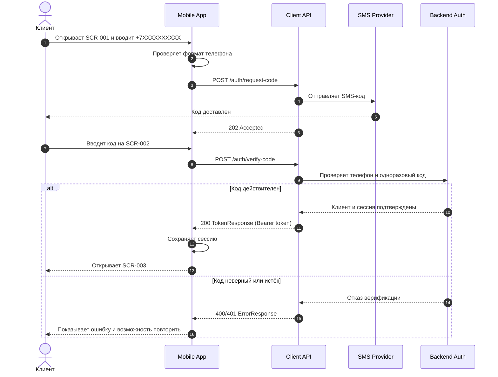
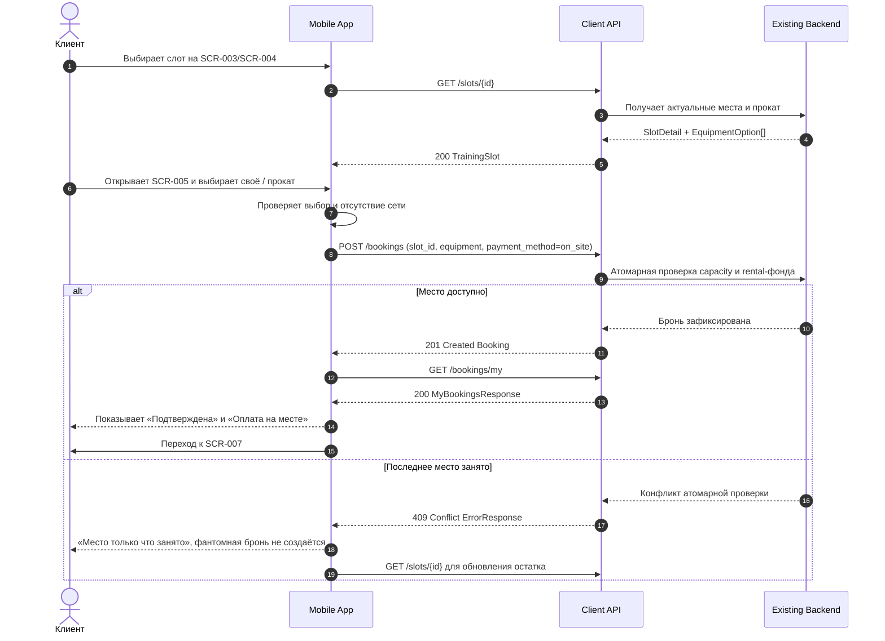
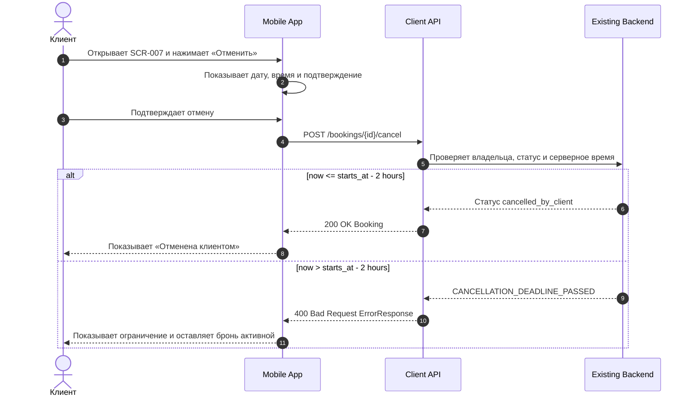
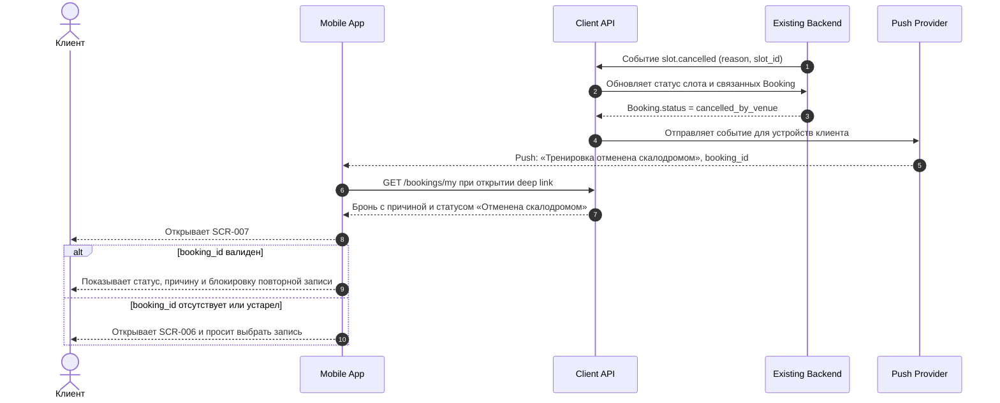

# Sequence-схемы Client API

## 1. Метаданные

| Поле | Значение |
|---|---|
| Документ | `API-SEQUENCE-001` |
| Назначение | Показать взаимодействие приложения, Client API, backend и внешних сервисов |
| Сценарии | SMS-вход, бронирование, отмена, отмена скалодромом |
| Источник | BR-001, BR-004, BR-007, BR-008, BR-013; FR-001, FR-004, FR-006, FR-008, FR-009, FR-011 |
| Статус | MVP baseline |

## 2. Вход по SMS

## 3. Создание брони с выбором снаряжения

## 4. Клиентская отмена брони

## 5. Отмена слота скалодромом и push

## 6. Правила обработки результатов

| Результат | Поведение приложения | Трассируемость |
|---|---|---|
| `201 Created` на `/bookings` | Создать только одну подтверждённую запись, показать оплату на месте | FR-004, FR-006, NFR-002, NFR-003 |
| `409 Conflict` | Не добавлять локальную бронь, обновить слот, показать конкуренцию | FR-004, NFR-003, INV-002 |
| `200 OK` на отмену | Перерисовать детали и список из ответа API | FR-008, BR-007 |
| `400 Bad Request` по дедлайну | Оставить броню без изменения, показать срок 2 часа | FR-008, BR-007, INV-005 |
| Push от отмены | Не удалять бронь, открыть SCR-007, показать причину | FR-009, FR-011, BR-008, BR-010 |
| Ошибка сети на записи | Показать Offline и не создавать Pending-бронь | NFR-005, FR-006 |

## 7. Ответственность участников

- **Mobile App:** собирает ввод, показывает состояния, блокирует повторные команды и обрабатывает ответы.
- **Client API:** формирует клиентский контракт, проверяет токен и передаёт атомарный результат backend.
- **Existing Backend:** хранит состояние, выполняет atomic capacity check и является источником истины.
- **SMS/Push Provider:** доставляет внешний сигнал; ошибка внешнего сервиса не подтверждает бизнес-операцию.
