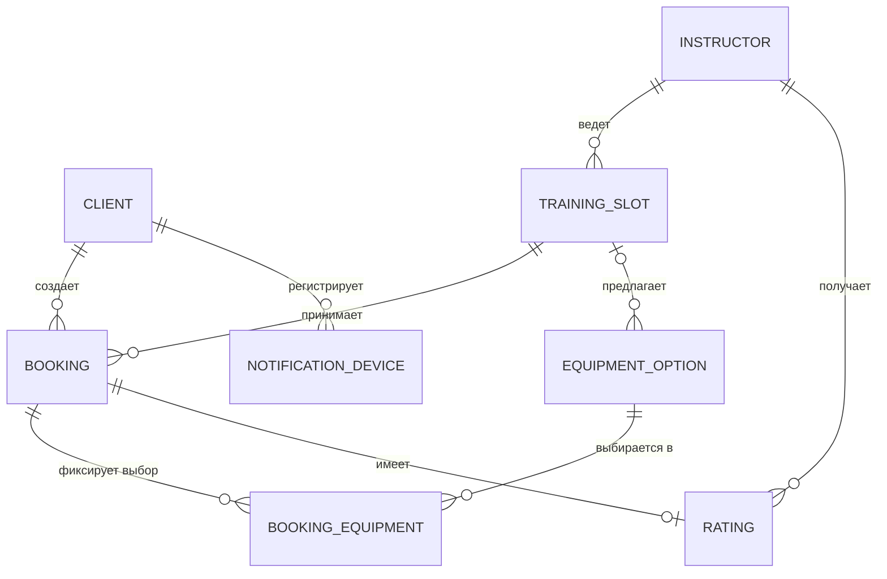
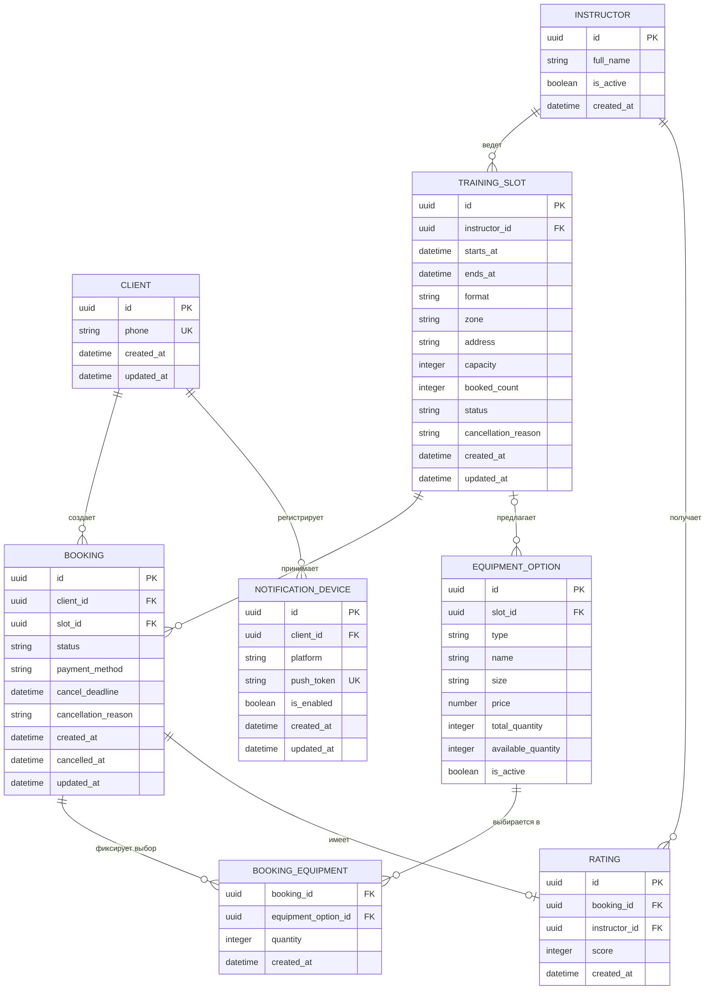

# Модель данных Client API

## 1. Метаданные

| Поле | Значение |
|---|---|
| Документ | `DATA-MODEL-001` |
| Назначение | Концептуальная и логическая модель данных для клиентского приложения |
| Границы | Client API и мобильное приложение Клиента |
| Источник истины | Существующий бэкенд |
| Связанные требования | BR-001…BR-014, FR-001…FR-011, NFR-003, NFR-004, NFR-005 |
| Статус | MVP logical model |

## 2. Концептуальная ER-модель

Диаграмма показывает бизнес-сущности и отношения без технических деталей реализации backend.

## 3. Логическая ER-модель

`BOOKING_EQUIPMENT` — техническая связь many-to-many между бронью и выбранными вариантами проката. Для одной брони допускается ноль, одна или две записи: скальники и/или страховочная система. `own`-варианты не требуют строки проката, а выбор rental хранится через `EquipmentOption`.

## 4. Каталог сущностей и полей

### Client

| Поле | Тип | Null | Ключ | Правило |
|---|---|---:|---|---|
| `id` | UUID | Нет | PK | Идентификатор клиента |
| `phone` | string(E.164) | Нет | UK | Формат `+7XXXXXXXXXX`; номер нормализуется backend |
| `created_at` | datetime UTC | Нет | — | Дата регистрации |
| `updated_at` | datetime UTC | Нет | — | Последнее изменение клиентского профиля |

### Instructor

| Поле | Тип | Null | Ключ | Правило |
|---|---|---:|---|---|
| `id` | UUID | Нет | PK | Идентификатор инструктора |
| `full_name` | string | Нет | — | Имя для отображения в расписании |
| `is_active` | boolean | Нет | — | Признак активности; не изменяется мобильным приложением |
| `created_at` | datetime UTC | Нет | — | Дата создания записи инструктора |

### TrainingSlot

| Поле | Тип | Null | Ключ | Правило |
|---|---|---:|---|---|
| `id` | UUID | Нет | PK | Идентификатор слота |
| `instructor_id` | UUID | Нет | FK → Instructor.id | Инструктор ведёт тренировку |
| `starts_at` | datetime UTC | Нет | — | Серверное время начала; источник дедлайна отмены |
| `ends_at` | datetime UTC | Нет | — | Время окончания |
| `format` | enum | Нет | — | `novice_bouldering` или `rope_routes` |
| `zone` | string | Нет | — | Зона или название площадки |
| `address` | string | Нет | — | Адрес зала |
| `capacity` | integer | Нет | — | 8 для новичкового формата, до 16 для остальных |
| `booked_count` | integer | Нет | — | Количество подтверждённых броней; контролируется backend |
| `status` | enum | Нет | — | `available`, `cancelled`, `completed` |
| `cancellation_reason` | string | Да | — | Причина отмены скалодромом |
| `created_at`, `updated_at` | datetime UTC | Нет | — | Аудит изменения внешней системы |

### Booking

| Поле | Тип | Null | Ключ | Правило |
|---|---|---:|---|---|
| `id` | UUID | Нет | PK | Идентификатор брони |
| `client_id` | UUID | Нет | FK → Client.id | Владелец брони; один клиент на запись |
| `slot_id` | UUID | Нет | FK → TrainingSlot.id | Слот тренировки |
| `status` | enum | Нет | — | `confirmed`, `cancelled_by_client`, `cancelled_by_venue`, `completed`, `rated` |
| `payment_method` | enum | Нет | — | В MVP только `on_site` |
| `cancel_deadline` | datetime UTC | Нет | — | Снимок `starts_at - 2 hours` для контролируемой отмены |
| `cancellation_reason` | string | Да | — | Причина отмены; обязательна для `cancelled_by_venue` |
| `created_at` | datetime UTC | Нет | — | Время создания |
| `cancelled_at` | datetime UTC | Да | — | Время клиентской отмены |
| `updated_at` | datetime UTC | Нет | — | Последнее изменение статуса |

Ограничение уникальности `(client_id, slot_id)` не заменяет проверку вместимости: один клиент не может повторно занять тот же слот, но разные клиенты конкурируют за общее ограничение capacity.

### EquipmentOption

| Поле | Тип | Null | Ключ | Правило |
|---|---|---:|---|---|
| `id` | UUID | Нет | PK | Идентификатор варианта проката |
| `slot_id` | UUID | Да | FK → TrainingSlot.id | Для контекста конкретного слота; глобальные позиции допускают NULL |
| `type` | enum | Нет | — | `climbing_shoes` или `harness_system` |
| `name` | string | Нет | — | Отображаемое название |
| `size` | string | Да | — | Размер, если применим |
| `price` | decimal(10,2) | Нет | — | Тариф проката; валюта фиксируется в контракте зала |
| `total_quantity` | integer | Нет | — | Общий размер фонда |
| `available_quantity` | integer | Нет | — | Остаток, предоставляемый backend |
| `is_active` | boolean | Нет | — | Доступность позиции во внешней инфраструктуре |

### BookingEquipment

| Поле | Тип | Null | Ключ | Правило |
|---|---|---:|---|---|
| `booking_id` | UUID | Нет | PK/FK → Booking.id | Первая часть составного PK |
| `equipment_option_id` | UUID | Нет | PK/FK → EquipmentOption.id | Вторая часть составного PK |
| `quantity` | integer | Нет | — | Для MVP всегда 1 |
| `created_at` | datetime UTC | Нет | — | Время фиксации выбора |

### Rating

| Поле | Тип | Null | Ключ | Правило |
|---|---|---:|---|---|
| `id` | UUID | Нет | PK | Идентификатор оценки |
| `booking_id` | UUID | Нет | FK → Booking.id, UK | Не более одной оценки на бронь |
| `instructor_id` | UUID | Нет | FK → Instructor.id | Инструктор получает оценку |
| `score` | integer | Нет | — | Целое значение от 1 до 5 |
| `created_at` | datetime UTC | Нет | — | Время сохранения |

### NotificationDevice

| Поле | Тип | Null | Ключ | Правило |
|---|---|---:|---|---|
| `id` | UUID | Нет | PK | Идентификатор устройства |
| `client_id` | UUID | Нет | FK → Client.id | Владелец токена |
| `platform` | enum | Нет | — | `ios` или `android` |
| `push_token` | string | Нет | UK | Токен push-сервиса |
| `is_enabled` | boolean | Нет | — | Разрешение клиента на доставку |
| `created_at`, `updated_at` | datetime UTC | Нет | — | Аудит регистрации устройства |

## 5. Связи и кардинальности

| Связь | Кардинальность | FK / целостность |
|---|---|---|
| Client → Booking | 1:N | Один клиент имеет много броней; booking не может быть без клиента |
| Instructor → TrainingSlot | 1:N | Слот всегда привязан к инструктору |
| TrainingSlot → Booking | 1:N | Один слот принимает много подтверждённых броней в пределах capacity |
| TrainingSlot → EquipmentOption | 1:N | Контекст проката для слота или глобальная позиция с nullable slot_id |
| Booking ↔ EquipmentOption | M:N через BookingEquipment | Уникальная пара `(booking_id, equipment_option_id)` |
| Booking → Rating | 1:0..1 | Уникальная оценка на завершённую бронь |
| Instructor → Rating | 1:N | Один инструктор получает много оценок |
| Client → NotificationDevice | 1:N | Клиент может иметь несколько устройств |

## 6. Права доступа мобильного приложения

| Сущность | READ | WRITE | Ограничение |
|---|---|---|---|
| Client | Только текущий `client_id` из токена | Создаётся при авторизации; отдельный произвольный write запрещён | Нельзя читать или менять чужие клиентские данные |
| Instructor | Разрешён для отображения расписания | Запрещён | Инструктор не является пользователем мобильного приложения |
| TrainingSlot | Разрешён для расписания и деталей | Запрещён | Приложение не создаёт, редактирует и не отменяет слот |
| Booking | Только свои брони | Создание и клиентская отмена | Нельзя менять статус напрямую, менять slot_id или client_id |
| EquipmentOption | Разрешён для карточки и выбора | Запрещён | Остаток и тариф меняет только внешняя инфраструктура |
| BookingEquipment | Разрешён в составе своей брони | Создаётся только вместе с Booking | Нельзя добавлять отдельной командой после подтверждения |
| Rating | Разрешена для своей завершённой брони | Создаётся один раз | Нельзя менять оценку или оценить не завершённую бронь |
| NotificationDevice | Только устройства текущего клиента | Регистрация, отключение и удаление своего токена | Нельзя управлять токенами других клиентов |

## 7. Ключевые бизнес-инварианты

| ID | Инвариант | Источник истины | Проверка |
|---|---|---|---|
| INV-001 | Не более одной подтверждённой брони клиента на один слот | Backend | Уникальный индекс `(client_id, slot_id)` |
| INV-002 | `booked_count <= capacity`; при конкуренции не более одного запроса получает место | Backend | Атомарная транзакция и race-тест; API возвращает 409 |
| INV-003 | Для `novice_bouldering` capacity не более 8, для `rope_routes` — не более 16 | Backend + Client API | Проверка значения при создании и выдаче слота |
| INV-004 | Нельзя создать бронь для `TrainingSlot.status = cancelled` | Backend | Отказ 400/409 без записи брони |
| INV-005 | Клиентская отмена разрешена при `now <= cancel_deadline` | Backend по серверному времени | `400 Bad Request` при нарушении дедлайна |
| INV-006 | `cancelled_by_venue` сохраняет booking и требует `cancellation_reason` | Backend | Проверка статуса и обязательного поля |
| INV-007 | Для rental-опции `available_quantity >= 1` на момент подтверждения | Backend | Проверка остатка в той же атомарной операции |
| INV-008 | Rating.score находится в диапазоне 1..5, booking.status = `completed`, rating ещё не существует | Backend | Уникальность booking_id и серверная валидация |
| INV-009 | `payment_method` равен `on_site`; платёжная транзакция не создаётся | Client API | Валидация запроса и отсутствие payment-операций в MVP |
| INV-010 | `NotificationDevice.push_token` уникален и принадлежит текущему клиенту | Backend | Уникальный индекс и проверка client_id |

## 8. Ответственность backend

Backend отвечает за атомарную проверку capacity и rental-фонда, транзакционную фиксацию брони, актуальные статусы и корректное время. Мобильное приложение не пытается компенсировать отсутствие транзакционной гарантии локальной логикой: при 409 оно не создаёт фантомную бронь, а при Offline блокирует команду.
